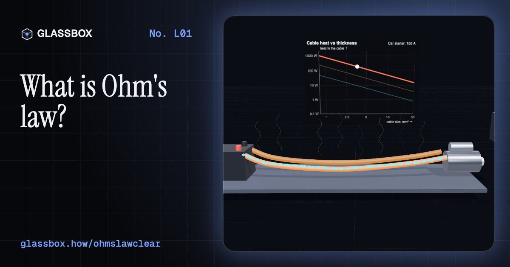
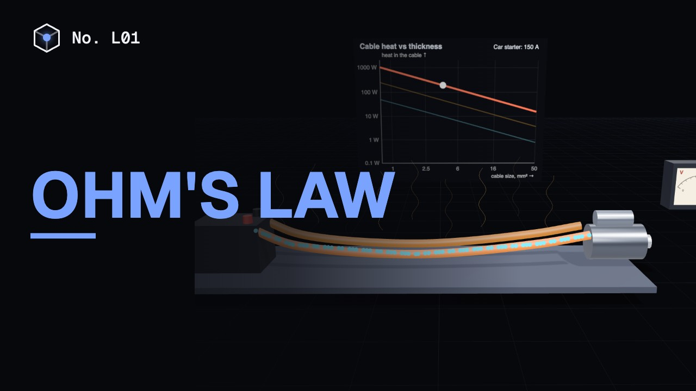
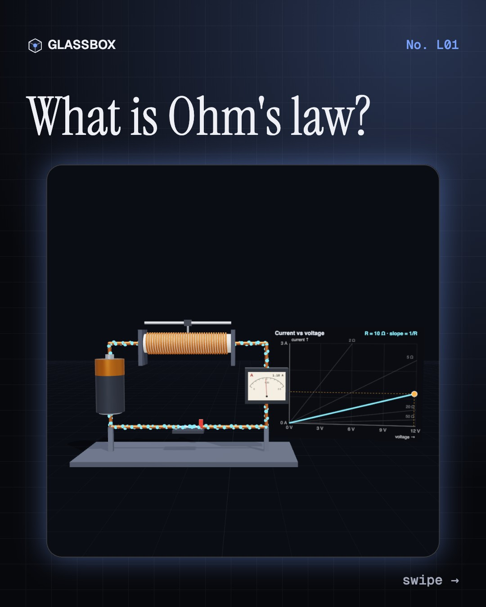
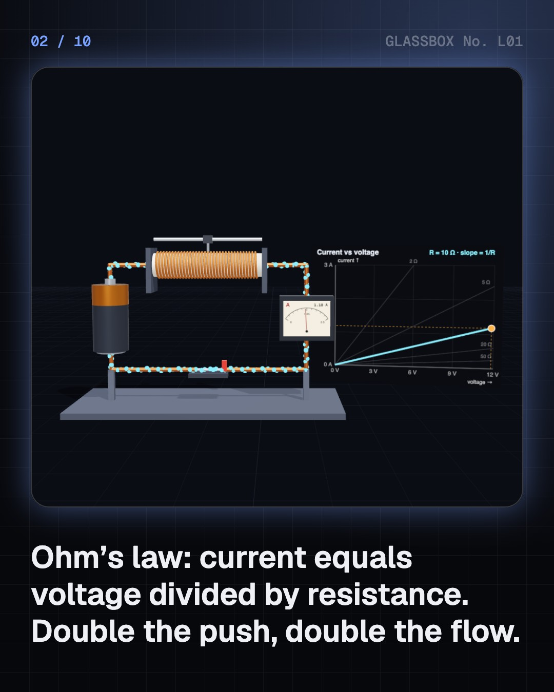
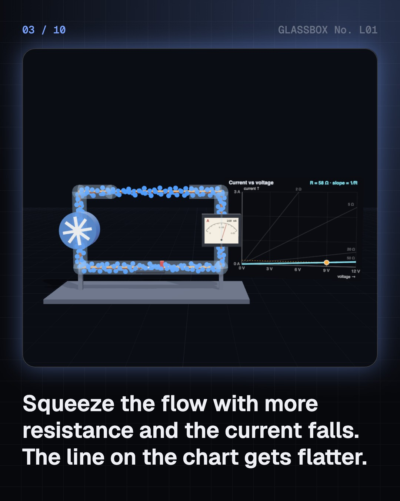
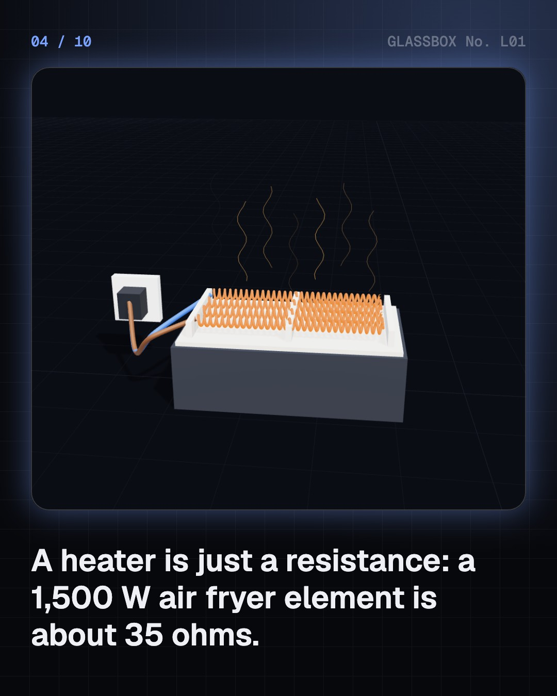

<!-- glassbox:start -->
<!-- Generated from glassbox.json by the Glassbox hub (npm run readme -- ohmslawclear). Edit glassbox.json, not this block. -->
<p align="center"><a href="https://glassbox.how/e/ohmslawclear/"></a></p>

<h1 align="center">Ohm's law</h1>

<p align="center"><b>What is Ohm's law?</b><br>Twice the push, twice the flow: one line of algebra runs every heater, charger and fuse in your home. Drive electrons round a 3D circuit, see why they crawl while the light comes on instantly, and find where Ohm's law finally breaks.</p>

<p align="center"><a href="https://glassbox.how/ohmslawclear/"><b>▶ Play with it</b></a> &nbsp;·&nbsp; <a href="https://glassbox.how/e/ohmslawclear/">Read the 60-second explainer</a> &nbsp;·&nbsp; <a href="https://glassbox.how/ohmslawclear/glassbox/reel.mp4">Watch the 40-second video</a></p>

<p align="center">
  <a href="https://glassbox.how/e/ohmslawclear/"></a>
  <a href="https://glassbox.how/e/ohmslawclear/"></a>
  <a href="LICENSE"></a>
  <a href="LICENSE-CONTENT.md"></a>
  <a href="#privacy"></a>
</p>

## In 60 seconds

1. **Voltage pushes, resistance holds back.** Current is how much charge flows each second. It equals the push, voltage, divided by the resistance: I = V ÷ R. Double the voltage and the current doubles; double the resistance and it halves. On a current–voltage graph that is a straight line.
2. **Resistance turns electricity into heat.** The heat made each second is P = I² × R, or V² ÷ R. A 1,500 W air fryer element is about 35 Ω. The cord carries the same current but has 500 times less resistance, so the element glows and the cord stays cool.
3. **Low voltage needs fat cables.** For the same power, a 12 V battery must push twenty times the current of a 230 V socket. Cable heat grows with current squared, so inverter and car starter cables are as thick as a finger.
4. **MCBs guard wires, RCCBs guard you.** Too many heaters on one circuit push the current past 16 A and an MCB trips to save the wire. Your body is a resistor too: wet skin lets 230 V drive a deadly current, so an RCCB cuts the power when 30 mA leaks away.
5. **Where the straight line bends.** A bulb filament's resistance rises about 14 times as it heats, so it surges at switch-on. LEDs barely conduct until about 2 V, then shoot up, so they need a resistor. And below 4.2 K mercury's resistance drops to exactly zero.

## Words worth knowing

| Term | Meaning |
|---|---|
| **Voltage** | The electrical push that drives charge round a circuit, measured in volts (V). |
| **Current** | How much electric charge flows past a point each second, measured in amps (A). |
| **Resistance** | How strongly something opposes current, measured in ohms (Ω). One volt drives one amp through one ohm. |
| **Power** | Energy per second, in watts: P = V × I = I² × R. |
| **Drift speed** | The slow average speed of electrons along a wire, well under a millimetre per second. |
| **Resistivity** | A material's own resistance for a 1 m cube; wire resistance is resistivity × length ÷ area. |
| **Ohmic** | Obeying Ohm's law: current in proportion to voltage, a straight I–V line. |
| **Superconductor** | A material whose resistance falls to exactly zero below a critical temperature. |

## A short history

**From a scientist timing his own electric shocks to an ohm fixed by the constants of nature.**

- **1800** · A steady current at last (Alessandro Volta, Pavia (then Austrian Lombardy))
- **1820** · A compass needle feels the current (Hans Christian Ørsted, Copenhagen)
- **1826** · The decisive experiment (Georg Simon Ohm, Cologne, Prussia)
- **1827** · Die galvanische Kette (Georg Simon Ohm, Berlin, Prussia)
- **1841** · Recognition from London (Royal Society, London, England)
- **1861** · A unit named Ohma (Latimer Clark and Charles Bright; British Association, Manchester and London, England)
- **1900** · Why metals obey the law (Paul Drude, Leipzig)
- **1911** · Resistance vanishes (Heike Kamerlingh Onnes, with Gilles Holst and others, Leiden)

The full story, with 19 moments, charts, people and 21 sources: [glassbox.how/e/ohmslawclear/history](https://glassbox.how/e/ohmslawclear/history/). The data lives in [`history.json`](history.json).

## Video and slides

Made with the Glassbox studio from this box's storyboard (`window.glassbox.director`). Free to reuse under CC BY 4.0.

<a href="https://glassbox.how/ohmslawclear/glassbox/video.mp4"></a>

<p><a href="glassbox/slide-1.jpg"></a> <a href="glassbox/slide-2.jpg"></a> <a href="glassbox/slide-3.jpg"></a> <a href="glassbox/slide-4.jpg"></a></p>

| File | What | Size |
|---|---|---|
| [`glassbox/reel.mp4`](https://glassbox.how/ohmslawclear/glassbox/reel.mp4) | Reel / Short, with captions and soundtrack | 1080×1920 |
| [`glassbox/video.mp4`](https://glassbox.how/ohmslawclear/glassbox/video.mp4) | YouTube video, with captions and soundtrack | 1920×1080 |
| `glassbox/slide-1…10.jpg` | Instagram carousel | 1080×1350 |
| `glassbox/thumb.jpg` | YouTube thumbnail | 1280×720 |
| `glassbox/cover.jpg` | Share card and repo social preview | 1200×630 |
| [`glassbox/history-reel.mp4`](https://glassbox.how/ohmslawclear/glassbox/history-reel.mp4) | “History in 10 moments” Reel / Short | 1080×1920 |
| `glassbox/history-slide-*.jpg` | History carousel | 1080×1350 |
| `glassbox/post.json` | Post copy and schedule used by the publish kit | |

## Privacy

This box has no accounts and no ads, and it ships its own fonts and libraries. When you run it yourself it sends nothing anywhere. On glassbox.how, the site's `/bar.js` also loads Glassbox's analytics: **Google Analytics** to count visits (it asks first in the EU, UK and Switzerland, and stays off when your browser sends Global Privacy Control or Do Not Track) and **ClickTrust** to detect bots.

It remembers a few things **in your own browser only**, and never sends them anywhere:

| Browser storage key | What it holds |
|---|---|
| `ohmslawclear.v1` | Which chapters you have opened, your best quiz scores, and sound on or off. |

Exactly what each one sees is at [glassbox.how/privacy](https://glassbox.how/privacy/).

## Licences

- **Code:** [MIT](LICENSE). Use it, change it, ship it.
- **Explanations, text, images and videos** (`glassbox.json`, `glassbox/`): [CC BY 4.0](LICENSE-CONTENT.md). Credit “Glassbox, glassbox.how/e/ohmslawclear”.
- **Third-party parts** keep their own licences: [three.js](https://threejs.org) (MIT), [Geist, Instrument Serif](https://openfontlicense.org) (SIL OFL 1.1).
- The Glassbox name and logo aren't covered by either licence. See the [terms](https://glassbox.how/terms/).

Found a mistake? [Open an issue](https://github.com/bdeeps/ohmslawclear/issues). Corrections happen in public.
<!-- glassbox:end -->

## Run it

It's plain HTML, CSS and JavaScript. No build step and no dependencies. Run locally, it contacts no other website.

```bash
python3 -m http.server 8000
```

Three.js and the fonts ship in `vendor/` and `fonts/`, so it also works offline.

Then open http://localhost:8000.

## How it's built

| File | What |
|---|---|
| `index.html`, `css/app.css` | The page and its styles |
| `js/app.js`, `js/stage.js`, `js/ui.js`, `js/kit.js` | The shared Glassbox 3D engine: chapters, 3D stage, controls, quiz, video director |
| `js/ohm.js` | Shared parts and physics: wire paths with flowing electrons, battery, rheostat, meters with live dials, bulb, chart boards, copper resistivity and drift speed |
| `js/chapters/*.js` | One file per chapter: the 3D model, controls, text, key terms, quiz and video scenes |
| `glassbox.json` | Title, question, explainer beats, key terms, browser storage and credits shown on glassbox.how |
| `reel` in each chapter | The storyboard the Glassbox studio records into short videos |
| `glassbox/` | The published video, slides, thumbnail and post copy |
| `fonts/`, `vendor/three/` | Self-hosted Geist and Instrument Serif (SIL OFL 1.1) and three.js (MIT) |
